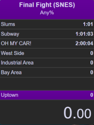

# OpenSplit

    

> **Free & open-source speedrun split timer with an emphasis on customization.**

[Join the ZellyDev Games Discord](https://discord.com/invite/xcrHKCsGmv) and select "OpenSplit" to discuss the application or get involved with development!

  <a href="#quickstart">Quickstart</a> •
  <a href="#downloads">Nightly builds</a> •
  <a href="#skins">Skins</a> •
  <a href="#development">Development</a> •
  <a href="#contributing">Contributing</a>

---

## Highlights
- 🖥️ **Cross Platform**.
- 🕒 **Fast, readable timer** built for speedrunning.
- 🎨 **Fully skinnable UI** — drop CSS-based skins into a folder and switch at runtime.
- 🎮 **Global hotkeys**.
- 🔎 **Speedrun.com integration** to search games, categories, and fetch art.
- 🏁 **Racetime.gg integration** to facilitate live racing.
- 🧰 **Modern stack**: Go + React/TypeScript via Wails.

> Status: early development/alpha. Expect rapid change and frequent nightlies.

---

## Downloads

**Nightly builds** (updated on each merge to `main`):

- [Windows (x64)](https://github.com/ZellyDev-Games/OpenSplit/releases/download/nightly/opensplit-windows-amd64.zip)
- [macOS (Apple Silicon)](https://github.com/ZellyDev-Games/OpenSplit/releases/download/nightly/opensplit-darwin-arm64.zip)
- [Linux]([https://github.com/ZellyDev-Games/OpenSplit/releases/download/nightly/opensplit-linux-amd64.zip](https://github.com/ZellyDev-Games/OpenSplit/releases/tag/nightly))

---

## Quickstart

### Run the app
1. Download a nightly for your OS (or build from source).
2. Unzip and run the binary. For Mac Open the DMG and move OpenSplit to Applications.
    * On Mac there's a couple of additional steps:
    * from a terminal run `xattr -rd com.apple.quarantine /Applications/OpenSplit.app` to clear the qurauntine flags.
    * Go to Settings > Privacy and Security > Accesibility and remove OpenSplit with the "-" button at the bottom if it exists.
    * Click the "+" button then add /Applications/OpenSplit.  You'll need to do this every new version.
    * Go to Settings > Privacy and Security > Input Monitoring and remove OpenSplit with the "-" button at the bottom if it exists.
    * Click the "+" button then add /Applications/OpenSplit.  You'll need to do this every new version.
4. Click "Create Split File" to get started.

### Create your first splitfile
- Create a new split file (Game + Category).
- Add segments, press **Split** hotkey (default: `Space`) to start a run.
- Press your **Split** hotkey (default: `Space`) at each segment end.

---

## Features (current & roadmap)
- **Timer**: HH:MM:SS.cc display with centiseconds; formatting adapts to hours/minutes.
- **Skins**: theme tokens + component styles + images; per-skin folder with live switching.
- **Split editor**: add/rename/remove; total attempts.
- **Hotkeys**: Cross-platform global hotkeys for Windows, Mac, and X11 Linux distros.  Wayland coming soon.
- **Data**: simple JSON split files (`.osf`) for portability.
- **Integrations**: Speedrun.com lookup for game/category art.

---

## Development
[Contributing – Development](./CONTRIBUTING.md#development-prerequisites)

## Contributing
There's many ways to help with the project, [How to contribute](./CONTRIBUTING.md)

## Architecture

OpenSplit uses **[Wails](https://wails.io/)** to bundle a Go backend and a React/TypeScript frontend.
